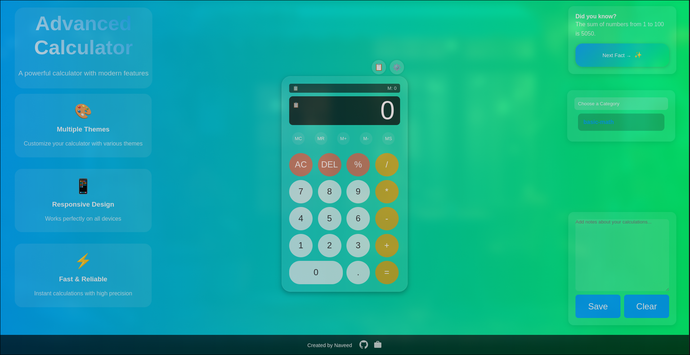
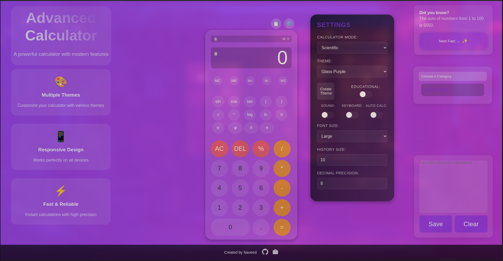
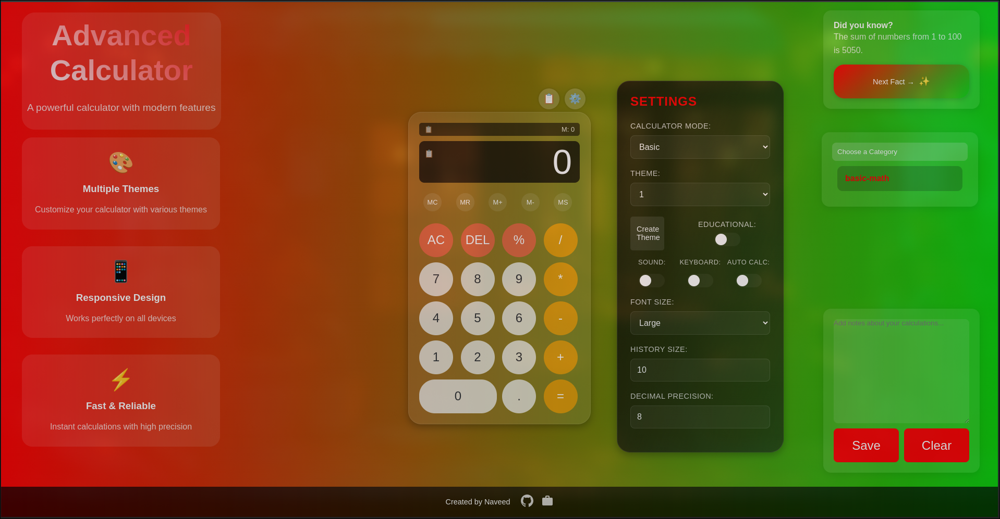

# 🧮 Advanced Online Calculator

## 🌟 Project Overview

An advanced, feature-rich online calculator designed for a modern, seamless experience. This tool goes beyond traditional calculators by offering scientific functions, educational features, and customizable themes. Built with **HTML**, **CSS**, and **JavaScript**, it delivers versatility, responsiveness, and elegance.


---

## ✨ Key Features

### 🎨 Customizable Themes
- **Multiple Built-in Themes**: Switch effortlessly between pre-designed themes.
- **Custom Theme Creator**: Personalize colors with a live preview.
- **Responsive Modes**: Automatically toggles between dark and light themes based on system settings.

### 🧮 Advanced Calculation Modes
- **Basic Calculator**: Perform arithmetic operations.
- **Scientific Calculator**: Access advanced mathematical functions.
- **Memory Functions**: Store, recall, and manipulate values.
- **Precision Control**: Adjust decimal accuracy.

### 🌈 Unique Capabilities
- **Educational Mode**: Learn with tooltips and interactive guides.
- **Formula Library**: Quickly insert mathematical formulas by category.
- **Calculation History**: View and reuse previous calculations.
- **Quick Notes**: Jot down ideas or steps alongside calculations.
- **Feedback Options**: Enable sound and vibration feedback for tactile engagement.

---

## 🚀 Technologies Used

  
  


---

## 🔥 Standout Features

### 1. Theme Customization
- Choose primary, secondary, and accent colors.
- Preview changes in real-time.
- Save and apply themes instantly.

### 2. Scientific Mode *(Under Construction)*
- Perform advanced operations:
  - **Trigonometry**: sin, cos, tan.
  - **Logarithms**: log and ln.
  - **Constants**: π, e.
  - **Powers & Roots**: Exponentiation and square roots.

### 3. Formula Library *(Under Construction)*
- Categorized formulas:
  - Basic Math
  - Geometry
  - Algebra
  - Trigonometry
- Insert formulas with a single click.
- Adaptable layout for accessibility.

### 4. Accessibility & UX
- **Keyboard Shortcuts** for faster navigation.
- **Responsive Design** for all devices.
- **Educational Tooltips** to guide users.
- **Adaptive Font Sizing** for readability.

---

## 🛠 Installation

1. Clone the repository:
   ```bash
   git clone https://github.com/your-username/advanced-calculator.git
   ```
2. Open the `index.html` file in your browser.

---

## 🎮 Usage

### Basic Operations
- Perform simple arithmetic: addition, subtraction, multiplication, division.
- Calculate percentages.
- Control decimal precision for accurate results.

### Advanced Features
- **Scientific Mode**: Access trigonometric, logarithmic, and other advanced functions.
- **Memory Functions**: Save, recall, and manipulate stored values.
- **Theme Customization**: Personalize your calculator's appearance.
- **Formula Library**: Quickly retrieve and use mathematical formulas.

### Keyboard Shortcuts
| Key         | Action                  |
|-------------|-------------------------|
| `Enter`     | Calculate result        |
| `Escape`    | Clear all entries       |
| `Backspace` | Delete last character   |
| `H`         | Toggle Calculation History |

---

## 📸 Screenshots

### Default View


### Scientific Mode


### Custom Theme Creator


---

## 🤝 Contributing

Contributions are warmly welcomed! Follow these steps:

1. **Fork the repository**.
2. **Create a feature branch**:
   ```bash
   git checkout -b feature/AmazingFeature
   ```
3. **Commit your changes**:
   ```bash
   git commit -m 'Add some AmazingFeature'
   ```
4. **Push to the branch**:
   ```bash
   git push origin feature/AmazingFeature
   ```
5. **Open a Pull Request**.

---

## 📞 Contact

👤 **Naveed Sohail Gung**  
🌐 [Portfolio](https://por-fo-lio.netlify.app/)  
🐱 [GitHub](https://github.com/naveed-gung)

---

## 🌟 Support the Project

Help this project grow! You can:

- ⭐ **Star** the repository
- 🍴 **Fork** and contribute
- 💡 **Open issues** with suggestions
- 📣 **Spread the word**

---

**Made with ❤ by Naveed**

