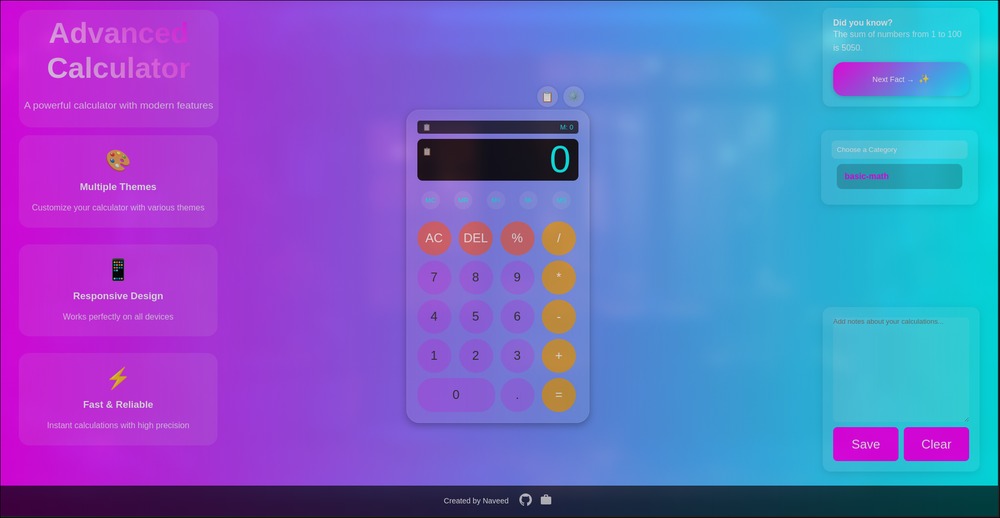

# 🧮 Advanced Online Calculator

## 🌟 Project Overview

An advanced, feature-rich online calculator with a modern, responsive design that goes beyond traditional calculation tools. Built with HTML, CSS, and JavaScript, this calculator offers a sleek user experience with multiple themes, scientific functions, and innovative features.

## ✨ Key Features

### 🎨 Customizable Themes
- Multiple built-in themes
- Custom theme creator
- Responsive dark and light modes

### 🧮 Advanced Calculation Modes
- Basic Calculator
- Scientific Calculator
- Memory Functions
- Precision Control

### 🌈 Unique Capabilities
- Educational Mode with Tooltips
- Formula Library
- Calculation History
- Quick Notes
- Sound and Vibration Feedback

## 🚀 Technologies Used

## 🔥 Standout Features

### 1. Theme Customization
Create your own calculator theme with a built-in color picker:
- Select primary, secondary, and accent colors
- Live preview of custom themes
- Save and apply custom themes instantly

### 2. Scientific Mode
Advanced mathematical operations:
- Trigonometric functions (sin, cos, tan)
- Logarithmic calculations
- Square root and power functions
- Constant values (π, e)

### 3. Formula Library
Comprehensive formula reference:
- Categories: Basic Math, Geometry, Algebra, Trigonometry
- One-click formula insertion
- Dynamic layout adjustment

### 4. Accessibility & UX
- Keyboard shortcuts
- Sound and vibration feedback
- Responsive design
- Educational tooltips
- Adaptive font sizing

## 🛠 Installation

1. Clone the repository
git clone https://github.com/your-username/advanced-calculator.git
Open index.html in your browser
🎮 Usage
Basic Calculations: Simple arithmetic operations
Scientific Mode: Advanced mathematical computations
Memory Functions: Store and recall values
Theme Switching: Change calculator appearance
Formula Library: Quick access to mathematical formulas
📸 Screenshots
Default Theme
Default Theme

Scientific Mode
Scientific Mode

Custom Theme Creator
Theme Creator

🤝 Contributing
Contributions are welcome! Please follow these steps:

Fork the repository
Create your feature branch (git checkout -b feature/AmazingFeature)
Commit your changes (git commit -m 'Add some AmazingFeature')
Push to the branch (git push origin feature/AmazingFeature)
Open a Pull Request
🔒 License
Distributed under the MIT License. See LICENSE for more information.

📞 Contact
Naveed - Portfolio GitHub: @naveed-gung

🌟 Support
If you find this project helpful, please consider:

⭐ Starring the repository
🍴 Forking the project
💡 Suggesting improvements via issues
Made with ❤️ by Naveed

Visits Badge
